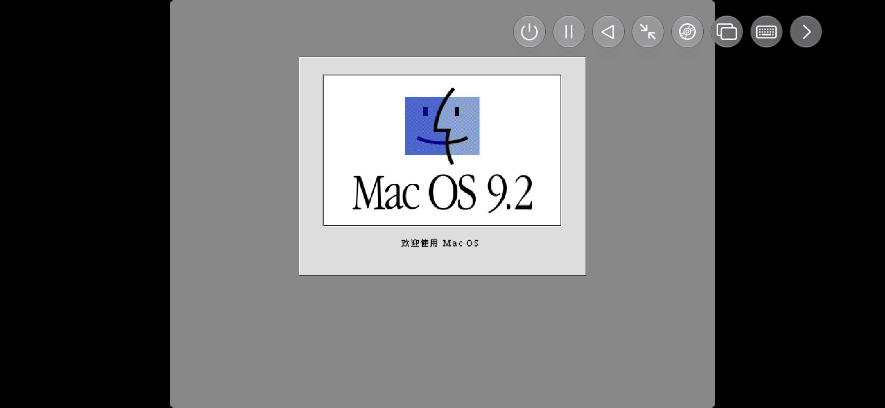
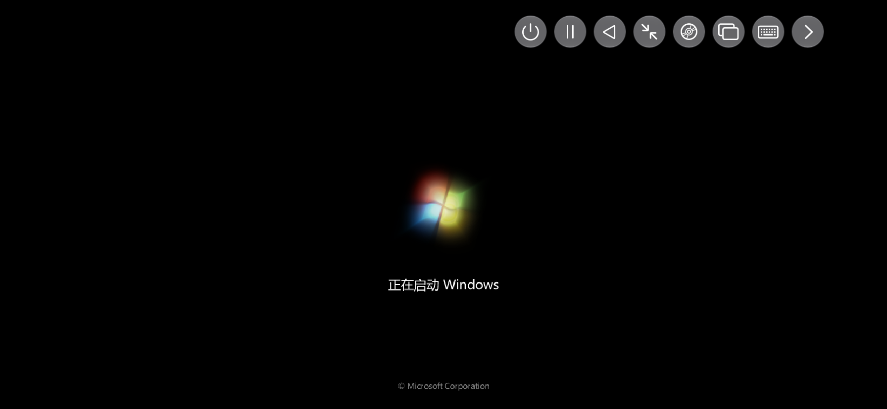

# PC on iPhone

PC on iPhone 是 UTM 的优化版，适用于 iOS 的全功能系统模拟器与虚拟机宿主。它基于 QEMU，让你在 iPhone 和 iPad 上运行 Windows、Linux 等系统。

<p align="center">
  
  
</p>

---

## 特色

- 基于 QEMU 的全系统模拟（MMU、设备等）
- 支持 30+ 处理器架构，包括 x86_64、ARM64 和 RISC-V
- 使用 SPICE 与 QXL 的 VGA 图形模式
- 文本终端模式
- USB 设备直通
- 基于 QEMU TCG 的 JIT 加速
- 采用最新 API，为 iOS 11+ 从头设计的前端
- 直接在设备上创建、管理与运行虚拟机

## 关于 SE 版本

PC on iPhone/QEMU 需要动态代码生成（JIT）才能获得最佳性能。iOS 上的 JIT 需要越狱设备，或针对特定 iOS 版本的各种变通方案。

**SE（Slow Edition，较慢版）** 改用线程解释器，性能优于传统解释器，但仍慢于 JIT。该技术与 [iSH](https://github.com/ish-app/ish) 用于动态执行的方案类似。因此 SE 不需要越狱或任何 JIT 变通方案，可作为常规应用侧载安装。

为优化体积与构建时间，SE 仅包含以下架构：ARM、PPC、RISC-V、x86（均有 32 位与 64 位变体）。

## 构建

```bash
# 1. 构建依赖 sysroot（首次约需数小时，会下载并交叉编译 QEMU 等 40 个依赖）
./scripts/build_dependencies.sh -p ios -a arm64

# 2. 用 Xcode 打开工程
open UTM.xcodeproj
```

依赖清单、版本锚点与构建细节见 [DEPENDENCIES.md](DEPENDENCIES.md)。

### 环境要求

| 项 | 要求 |
| --- | --- |
| Xcode | 完整工具链（含命令行工具） |
| 主机依赖 | `glib-utils`（`glib-mkenums`、`glib-compile-resources` 需在 `$PATH` 中） |
| 部署目标 | iOS 26.0（见 `Build.xcconfig`） |

> ⚠️ `scripts/build_dependencies.sh` 按需从上游拉取依赖，**不会**从本仓库读取。首次构建耗时较长，需稳定网络。

## 相关项目

- [iSH](https://github.com/ish-app/ish) —— 模拟用户态 Linux 终端接口，在 iOS 上运行 x86 Linux 应用
- [a-shell](https://github.com/holzschu/a-shell) —— 为 iOS 原生构建的通用 Unix 命令与实用工具，通过终端接口访问

## 许可

本项目基于 **Apache 2.0** 许可证分发。但它使用了若干 (L)GPL 组件：多数为动态链接，但 GStreamer 插件为静态链接，且部分代码取自 QEMU。若计划重新分发本应用，请留意这一点。

部分图标由 [Freepik](https://www.flaticon.com/) 制作。

前端还依赖以下 MIT/BSD 许可组件：

- [IQKeyboardManager](https://github.com/hackiftekhar/IQKeyboardManager)
- [SwiftTerm](https://github.com/migueldeicaza/SwiftTerm)
- [ZIPFoundation](https://github.com/weichsel/ZIPFoundation)
- [InAppSettingsKit](https://github.com/futuretap/InAppSettingsKit)

持续集成托管由 [MacStadium](https://www.macstadium.com/) 提供。
